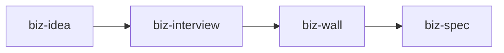
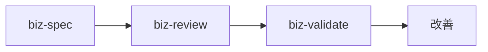
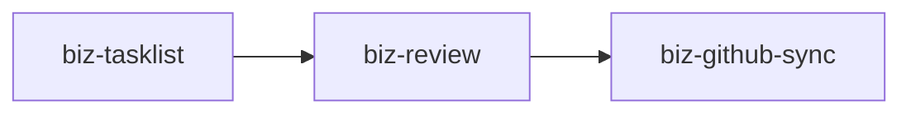

# Business Development Commands Help

ビジネス開発の各フェーズで使用できるコマンド群の詳細な使い方とワークフローガイドです。

## 🚀 Quick Start

### 基本的なワークフロー
```
1. アイデア分解 → 2. 仕様作成 → 3. レビュー → 4. タスク化 → 5. 実装
```

## 📚 コマンド一覧

### 🆘 biz-* コマンド概要

| Command | Purpose | Stage | Output |
|---------|---------|-------|--------|
| `/biz-idea` | アイデアを検証可能な仮説群に分解 | 💡 構想 | 仮説リスト |
| `/biz-spec` | 事業仕様書の作成と弱点分析 | 📋 企画 | 詳細仕様 |
| `/biz-review` | 多角的視点でのレビュー | 🔍 検証 | 改善提案 |
| `/biz-validate` | 検証プランの作成 | 🧪 実験 | 検証計画 |
| `/biz-tasklist` | 実装タスクへの分解 | 🔨 開発 | タスク表 |
| `/biz-wall` | 壁打ちセッション | 💭 相談 | フィードバック |
| `/biz-interview` | 顧客インタビューシミュレーション | 🎤 調査 | インサイト |
| `/biz-compete` | 複数案の比較評価 | ⚖️ 選定 | スコアリング |
| `/biz-github-sync` | GitHub連携 | 🔗 管理 | Issue化 |

## 📖 詳細な使い方

### 1. `/biz-idea` - アイデア分解

**目的**: 漠然としたアイデアを構造化し、検証可能な仮説に変換

**使用例**:
```
/biz-idea "AIを使って中小企業の在庫管理を自動化するサービス"
```

**出力内容**:
- 問題仮説（3-5個）
- 価値仮説（3-5個）
- 既存代替手段と差別化
- Why now（なぜ今なのか）

**次のステップ**: 
- 仕様化: `/biz-spec`
- 顧客理解: `/biz-interview`

---

### 2. `/biz-spec` - 事業仕様作成

**目的**: アイデアを実行可能な事業仕様に落とし込む

**使用例**:
```
/biz-spec "中小企業向けAI在庫管理サービスで、需要予測と自動発注を実現"
```

**出力内容**:
- ターゲット顧客（ペルソナ）
- 解決する課題
- コアソリューション
- 収益モデル
- KPIと成功基準
- Go-to-Market戦略

**評価スコア**: 5段階評価で弱点を可視化

---

### 3. `/biz-review` - 多角的レビュー

**目的**: 仕様やタスクを専門家視点でレビュー

**パラメータ**:
- `context`: spec（仕様）/ tasklist（タスク）
- `perspective`: PM / 投資家 / 顧客 / エンジニア / デザイナー / 法務
- `previous`: レビュー対象の内容

**使用例**:
```
/biz-review context=spec perspective=投資家 previous="[仕様書の内容]"
```

**出力**: 良い点、課題、具体的な改善提案

---

### 4. `/biz-validate` - 検証計画

**目的**: 仮説を検証するための実行計画を作成

**使用例**:
```
/biz-validate user_pain="在庫の過不足で年間売上の10%を損失" solution="AI需要予測"
```

**出力内容**:
- MVPアプローチの選定
- 検証ステップ（週単位）
- 成功指標（定量・定性）
- リスクと対策

---

### 5. `/biz-tasklist` - タスク分解

**目的**: 仕様を開発タスクに分解

**パラメータ**:
- `stage`: PoC / MVP / Launch
- `spec`: 仕様内容

**使用例**:
```
/biz-tasklist stage=MVP spec="AI在庫管理の基本機能実装"
```

**出力**: カテゴリ別タスク表、工数見積、依存関係

---

### 6. `/biz-wall` - 壁打ちセッション

**目的**: 特定の役割になりきって建設的な議論

**パラメータ**:
- `role`: PM / 投資家 / エンジニア / デザイナー / 法務 / 営業 / 顧客
- `tone`: critical（批判的）/ friendly（友好的）/ constructive（建設的）
- `target`: 議論対象

**使用例**:
```
/biz-wall role=顧客 tone=critical target="月額5万円のAI在庫管理サービス"
```

---

### 7. `/biz-interview` - インタビューシミュレーション

**目的**: 複数の役割から質問への回答を生成

**使用例**:
```
/biz-interview roles="中小企業経営者,在庫管理担当者" question="現在の在庫管理の課題は？" context="AI在庫管理サービスの提案"
```

**出力**: 各役割の回答、懸念事項、提案

---

### 8. `/biz-compete` - 競合比較

**目的**: 複数の事業案を比較評価

**パラメータ**:
- `specs`: 比較する事業案（複数）
- `perspective`: 収益性 / 実現性 / 成長性 / 社会性

**使用例**:
```
/biz-compete specs="AI在庫管理|需要予測SaaS|在庫コンサル" perspective=収益性
```

---

### 9. `/biz-github-sync` - GitHub連携

**目的**: タスクをGitHub Issueに変換

**使用例**:
```
/biz-github-sync repo="myorg/inventory-ai" tasks="[タスクリスト]"
```

**出力**: Issue作成スクリプト、Label設定、Milestone提案

## 🎯 推奨ワークフロー

### Phase 1: アイデア検証（1-2週間）


1. `/biz-idea` でアイデアを構造化
2. `/biz-interview` で顧客理解を深める
3. `/biz-wall` で批判的検証
4. `/biz-spec` で仕様化

### Phase 2: 仕様精緻化（1週間）


1. `/biz-review` で多角的レビュー
2. `/biz-validate` で検証計画作成
3. フィードバックを反映して改善

### Phase 3: 実装準備（1週間）


1. `/biz-tasklist` でタスク分解
2. `/biz-review` でタスクレビュー
3. `/biz-github-sync` でプロジェクト管理

## 💡 活用のコツ

### 1. 段階的な詳細化
- 最初は大まかなアイデアから開始
- フィードバックを受けながら徐々に具体化
- 完璧を求めすぎない

### 2. 多角的な視点
- 異なる役割での壁打ちを活用
- 批判的な視点も恐れない
- バランスの取れた判断

### 3. データドリブン
- 仮説は必ず検証可能な形に
- KPIを明確に定義
- 定量的な判断基準

### 4. アジャイルアプローチ
- 小さく始めて素早く検証
- フィードバックループを短く
- 柔軟にピボット

## 🔧 トラブルシューティング

### Q: どのコマンドから始めればいい？
A: アイデア段階なら `/biz-idea`、既に具体的なら `/biz-spec` から

### Q: レビューが厳しすぎる
A: `tone=friendly` や `tone=constructive` を使用

### Q: タスクが多すぎる
A: `stage=PoC` から始めて段階的に拡張

### Q: 次に何をすべきか分からない
A: 各コマンドの出力に「次のステップ」が含まれています

## 📊 成功指標

良いビジネスプランの特徴：
- ✅ 明確な顧客課題の定義
- ✅ 検証可能な価値提案
- ✅ 現実的な実行計画
- ✅ 測定可能な成功基準
- ✅ リスクへの対策

## 🚀 さあ、始めましょう！

最初のコマンドを実行：
```
/biz-idea "あなたのビジネスアイデアをここに入力"
```

---

**Need more help?** 各コマンドの詳細は、対応する `.md` ファイルを参照してください。