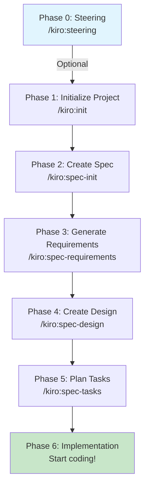

# Kiro Help - Spec-Driven Development Workflow

This command provides comprehensive guidance on using the Kiro specification-driven development system.

## What is Kiro?

Kiro is a specification-driven development framework that helps you build software features through a systematic, phase-based approach. It ensures proper documentation, planning, and review before implementation begins.

## Workflow Overview

The Kiro workflow follows these phases in order:



## Command Reference

### Phase 0: Steering (Optional)
**Commands:**
- `/kiro:steering` - Create/update standard steering documents
- `/kiro:steering-custom` - Create custom steering for specialized contexts

**Purpose:** Establish project context and constraints. Optional for new features or small additions.

**Creates:**
- `.kiro/steering/product.md` - Product overview and business context
- `.kiro/steering/tech.md` - Technology stack and development environment
- `.kiro/steering/structure.md` - Project structure and architectural patterns

### Phase 1: Project Initialization
**Command:** `/kiro:init`

**Purpose:** Initialize the Kiro system in your project with example specifications.

**Creates:**
- `.kiro/` directory structure
- Example specifications for learning
- Initial project setup

### Phase 2: Specification Initialization
**Command:** `/kiro:spec-init [detailed description]`

**Purpose:** Initialize a new feature specification based on your detailed project description.

**Example:**
```
/kiro:spec-init Create a user authentication system with email/password login, JWT tokens, password reset functionality, and role-based access control
```

**Creates:**
- `.kiro/specs/{feature-name}/` directory
- Template files: `requirements.md`, `design.md`, `tasks.md`
- `spec.json` for tracking approval status

### Phase 3: Requirements Generation
**Command:** `/kiro:spec-requirements [feature-name]`

**Purpose:** Generate detailed requirements using EARS format (Easy Approach to Requirements Syntax).

**Output:** Comprehensive requirements document with:
- User stories
- Acceptance criteria in EARS format
- Clear testable requirements

### Phase 4: Design Creation
**Command:** `/kiro:spec-design [feature-name]`

**Purpose:** Create technical design based on approved requirements.

**Interactive Approval:** Will prompt "requirements.mdをレビューしましたか？ [y/N]"
- If 'y': Auto-approves requirements and generates design
- If 'N': Stops for manual review

**Output:** Technical design document with:
- Architecture diagrams
- Technology decisions
- API specifications
- Data models
- Security considerations

### Phase 5: Task Planning
**Command:** `/kiro:spec-tasks [feature-name]`

**Purpose:** Generate implementation tasks based on approved design.

**Interactive Approval:** Will prompt for both requirements and design review
- Auto-approves both phases when confirmed

**Output:** Detailed task list with:
- Prioritized implementation tasks
- Time estimates
- Dependencies
- Testing requirements

### Phase 6: Status Checking
**Command:** `/kiro:spec-status [feature-name]`

**Purpose:** Check the current status of a specification.

**Shows:**
- Current phase
- Approval status for each document
- Next steps required

## Best Practices

### 1. Start with Steering (for new projects)
If starting a new project or major feature area, create steering documents first:
```
/kiro:steering
```

### 2. Provide Detailed Descriptions
When initializing a spec, be comprehensive:
```
/kiro:spec-init [include all features, technical requirements, and constraints]
```

### 3. Review Before Proceeding
Take time to review each phase before approving:
- Read generated documents thoroughly
- Ensure requirements are complete
- Verify design addresses all requirements
- Check tasks cover entire implementation

### 4. Use Interactive Approval
The interactive approval feature streamlines workflow:
- No manual JSON editing required
- Enforces review discipline
- Allows quick progression when ready

## Example Workflow

Here's a complete example for adding a shopping cart feature:

```bash
# 1. Initialize the specification
/kiro:spec-init Create a shopping cart feature with add/remove items, quantity updates, price calculation, discount codes, and persistent storage

# 2. Generate requirements
/kiro:spec-requirements shopping-cart

# 3. Review requirements.md, then generate design
/kiro:spec-design shopping-cart
# → Review prompt: "requirements.mdをレビューしましたか？ [y/N]"
# → Answer 'y' after reviewing

# 4. Review design.md, then generate tasks
/kiro:spec-tasks shopping-cart
# → Review prompts for both requirements and design
# → Answer 'y' after reviewing both

# 5. Check status anytime
/kiro:spec-status shopping-cart

# 6. Start implementation!
# All planning is complete, begin coding with clear tasks
```

## Troubleshooting

### Missing Steering Documents
- Steering is optional for new features
- Run `/kiro:steering` if you need project context

### Spec Already Exists
- Check existing specs with `ls .kiro/specs/`
- Use `/kiro:spec-status [name]` to see current phase

### Approval Workflow Issues
- Use 'N' response to stop and review manually
- Can still edit `spec.json` directly if needed

## Summary

The Kiro workflow ensures:
✅ **Clear Requirements** - No ambiguity about what to build
✅ **Thoughtful Design** - Architecture decided before coding
✅ **Organized Tasks** - Clear implementation roadmap
✅ **Review Discipline** - Quality gates at each phase

Start with `/kiro:spec-init [description]` and follow the workflow for successful spec-driven development!